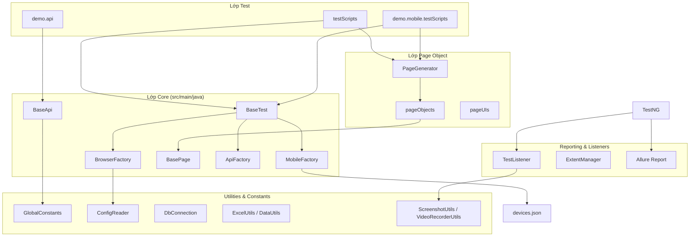

# Kiến trúc dự án

## Tổng quan

**Demo Framework** là bộ framework tự động hóa kiểm thử đa nền tảng, hỗ trợ:

- **Web UI** — Selenium WebDriver 4
- **Mobile** — Appium (Android / iOS)
- **API** — Rest Assured + GraphQL

Dự án dùng **Maven**, **Java 17**, **TestNG** làm test runner và **Allure** làm báo cáo chính.

## Sơ đồ kiến trúc



## Cấu trúc thư mục

```
auto_demo/
├── src/
│   ├── main/java/
│   │   ├── commons/          # Lớp nền: BasePage, BrowserFactory, MobileFactory, BaseApi, Retry
│   │   ├── constant/         # Hằng số toàn cục (URL, timeout, đường dẫn file)
│   │   ├── exception/        # Custom exception
│   │   └── utilities/        # Tiện ích: config, DB, Excel, screenshot, video...
│   └── test/java/
│       ├── commons/          # BaseTest, PageGenerator, ApiFactory
│       ├── demo/
│       │   ├── api/          # API client (REST, GraphQL)
│       │   ├── mobile/       # Page Object + test script mobile
│       │   └── web/          # Page Object + test script web
│       └── report/           # Listener, ExtentReports
├── src/test/resources/
│   ├── runTestCase.xml       # TestNG suite chính
│   ├── config.properties     # Cấu hình auth, URL, timeout
│   └── devices.json          # Cấu hình thiết bị mobile
├── uploadFiles/              # File dùng cho upload test
├── downloadFiles/            # Thư mục lưu file download
├── testData/                 # Dữ liệu test (Excel, JSON...)
├── report/                   # Allure report (sinh tự động sau mvn verify)
├── pom.xml
└── docker-compose.yml        # Selenium Grid (tùy chọn)
```

## Design Pattern

| Pattern | Áp dụng | Mô tả |
|---------|---------|-------|
| **Page Object Model (POM)** | Web & Mobile | Tách locator (`pageUIs`) và hành vi trang (`pageObjects`) |
| **Page Factory / Generator** | `PageGenerator` | Khởi tạo Page Object tập trung, tránh `new` trực tiếp trong test |
| **Factory** | `BrowserFactory`, `MobileFactory`, `ApiFactory` | Tạo driver / API client theo loại cần dùng |
| **ThreadLocal** | `BrowserFactory`, `MobileFactory` | Cô lập WebDriver/AppiumDriver khi chạy song song |
| **Singleton (lazy)** | `ApiFactory`, `ExtentManager` | Khởi tạo client API / report khi cần |
| **Retry Analyzer** | `RetryTest`, `RetryTransformer` | Tự động chạy lại test fail (tối đa 2 lần) |

## Luồng thực thi Web UI

1. TestNG đọc `runTestCase.xml` → khởi chạy class test.
2. `@BeforeClass` / `@BeforeMethod` gọi `getBrowserDriver(browser, url)` từ `BrowserFactory`.
3. `PageGenerator` tạo Page Object tương ứng.
4. Page Object kế thừa `BasePage` → thực hiện thao tác UI (click, sendKeys, wait...).
5. `BaseTest` cung cấp các hàm `verifyTrue`, `verifyEquals` để assert.
6. `@AfterClass` gọi `closeAllBrowsers()` dọn driver.
7. `TestListener` (nếu bật) chụp screenshot khi fail; Allure ghi step qua `@Step` / `Allure.step()`.

## Luồng thực thi Mobile

1. Test nhận parameter `deviceName`, `appiumUrl` từ TestNG XML.
2. `MobileFactory.createMobileDriver()` đọc `devices.json` theo `deviceName`.
3. Khởi tạo `AndroidDriver` (UiAutomator2) hoặc `IOSDriver` (XCUITest).
4. Page Object mobile dùng chung `BasePage` (smart scroll, swipe W3C...).
5. `TestListener` tự động quay video Appium khi test bắt đầu; lưu video + screenshot khi fail.

## Luồng thực thi API

1. Test gọi `apiFactory.getLoginRest()` / `getLoginGraphQL()` / `getCreateTicketV2()`.
2. API client kế thừa `BaseApi` → cấu hình base URI, headers, Allure Rest Assured filter.
3. Response được verify qua `verifyStatusCode`, `verifyJsonPath`, `extractValueFromResponse`.

## Xác thực (Authentication)

Framework hỗ trợ 3 cơ chế cho Web:

| Cơ chế | Phương thức | Nguồn cấu hình |
|--------|-------------|----------------|
| Bearer token qua CDP | `getBrowserDriverWithInjectHeader()` | `AUTH_TOKEN` env hoặc `auth.token` trong `config.properties` |
| Basic Auth trong URL | `getBrowserDriverWithCredentials()` | `auth.username`, `auth.password` hoặc biến môi trường |
| API Bearer | `BaseApi.setAuthToken()` | Token lấy từ response login API |

## Báo cáo

- **Allure** (chính): tích hợp qua `allure-testng`, `allure-rest-assured`; report sinh tại `report/allure-report-{timestamp}/` sau `mvn verify`.
- **ExtentReports** (phụ): qua `ExtentManager`, output tại `extentReport/Report.html`.
- **ReportNG** (legacy): `ReportNGListener`, screenshot tại `reportNGImage/`.

## Môi trường triển khai

- **Local**: chạy trực tiếp trên máy dev (Chrome, Firefox, Edge, Safari).
- **Docker Grid**: `docker-compose.yml` cung cấp Selenium Hub + Chrome node (cần cấu hình thêm remote URL trong test nếu dùng).
- **CI/CD**: `mvn clean verify` — Surefire chạy test, Allure plugin generate report ở phase `verify`.

## Phụ thuộc chính

| Thư viện | Phiên bản | Vai trò |
|----------|-----------|---------|
| Selenium | 4.24.0 | Web automation |
| Appium Java Client | 9.2.3 | Mobile automation |
| TestNG | 7.9.0 | Test runner |
| Allure | 2.32.0 | Reporting |
| Rest Assured | 5.4.0 | API testing |
| WebDriverManager | 5.9.2 | Quản lý driver binary |
| Apache POI | 5.3.0 | Đọc/ghi Excel |
| PostgreSQL JDBC | 42.7.4 | Kết nối DB |
| Jackson | 2.17.x | JSON parsing |
| JavaFaker | 1.0.2 | Sinh dữ liệu test |
