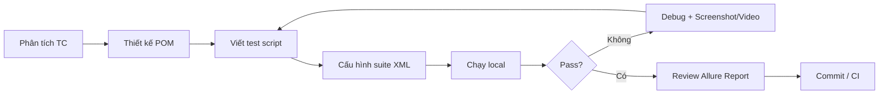

# Quy trình Automation

## Tổng quan quy trình



## 1. Phân tích & thiết kế test case

Trước khi code, xác định:

- **Loại test**: Web UI / Mobile / API / kết hợp (UI + DB).
- **Dữ liệu test**: hardcode, Excel (`testData/`), JSON, JavaFaker.
- **Pre-condition**: đăng nhập, inject token, mở app mobile.
- **Browser / device**: truyền qua TestNG parameter.

## 2. Tạo Page Object (Web)

### Bước 2.1 — Tạo Page UI (locators)

Tạo class trong `demo.web.pageUIs`:

```
src/test/java/demo/web/pageUIs/<TenTrang>PageUI.java
```

- Chỉ chứa `public static final By` locator.
- Đặt tên hằng số UPPER_SNAKE_CASE: `USERNAME_TEXTBOX`, `LOGIN_BUTTON`.

### Bước 2.2 — Tạo Page Object (actions)

Tạo class trong `demo.web.pageObjects`:

```
src/test/java/demo/web/pageObjects/<TenTrang>PO.java
```

- Kế thừa `BasePage`.
- Nhận `WebDriver` qua constructor.
- Mỗi method mô tả **một hành vi người dùng** (không expose locator ra ngoài).
- Method trả về Page Object tiếp theo khi chuyển trang (flow navigation).

### Bước 2.3 — Đăng ký PageGenerator

Thêm factory method vào `commons.PageGenerator`:

```java
public static TenTrangPO getTenTrangPage(WebDriver driver) {
    return new TenTrangPO(driver);
}
```

## 3. Tạo Page Object (Mobile)

Cấu trúc tương tự Web:

```
demo/mobile/pageUIs/<TenManHinh>PageUI.java
demo/mobile/pageObjects/<TenManHinh>PO.java
```

Mobile-specific:

- Dùng `smartScrollToElement()` cho danh sách dài.
- Truyền `androidCondition` (UiSelector) và `iosPredicate` khi scroll.
- Swipe dùng `swipeBetweenTwoPoints()` hoặc W3C Actions trong `BasePage`.

## 4. Tạo API Client

Tạo class trong `demo.api`, kế thừa `BaseApi`:

```java
public class TenApi extends BaseApi {
    public Response goiApi(String param) {
        return post("/endpoint", body);
    }
}
```

Đăng ký trong `commons.ApiFactory` nếu cần lazy init.

## 5. Viết Test Script

Tạo class trong `demo.web.testScripts` hoặc `demo.mobile.testScripts`:

### Web UI template

```java
public class TenTest extends BaseTest {

    @Parameters({"browser", "url"})
    @BeforeClass
    public void beforeClass(String browserName, String appUrl) {
        driver = getBrowserDriver(browserName, appUrl);
        // hoặc: getBrowserDriverWithInjectHeader() / getBrowserDriverWithCredentials()
        pagePO = PageGenerator.getTenTrangPage(driver);
    }

    @Test
    public void tenTestCase() {
        // Thực hiện flow + verify
        verifyTrue(pagePO.isElementDisplayed(...));
    }

    @AfterClass(alwaysRun = true)
    public void afterClass() {
        closeAllBrowsers();
    }

    private WebDriver driver;
    TenTrangPO pagePO;
}
```

### Mobile template

```java
public class TenMobileTest extends BaseTest {

    @Parameters({"deviceName", "appiumUrl"})
    @BeforeMethod
    public void beforeMethod(String deviceName, String appiumUrl) {
        driver = getMobileDriver(deviceName, appiumUrl);
        appPO = PageGenerator.getDangNhapAppPO(driver);
    }

    @Test
    public void tenTestCase() { /* ... */ }

    @AfterMethod(alwaysRun = true)
    public void afterMethod() {
        closeAllMobiles();
    }
}
```

### API template

```java
public class TenApiTest extends BaseTest {

    @Test
    public void loginApi() {
        Response res = apiFactory.getLoginRest().loginWithRest(email, password);
        verifyEquals(res.getStatusCode(), 200);
    }
}
```

## 6. Cấu hình TestNG Suite

Chỉnh `src/test/resources/runTestCase.xml`:

```xml
<test name="Ten Test - Chrome">
    <parameter name="browser" value="chrome"/>
    <parameter name="url" value="https://stg-crm.smarthiz.vn/login"/>
    <classes>
        <class name="demo.web.testScripts.TenTest"/>
    </classes>
</test>
```

Mobile:

```xml
<test name="App Test">
    <parameter name="deviceName" value="V350C"/>
    <parameter name="appiumUrl" value="http://127.0.0.1:4723"/>
    <classes>
        <class name="demo.mobile.testScripts.DemoApp"/>
    </classes>
</test>
```

### Bật listener (screenshot / video)

Uncomment trong suite:

```xml
<listeners>
    <listener class-name="report.TestListener"/>
</listeners>
```

### Bật retry tự động

Thêm listener cho test cụ thể:

```xml
<listener class-name="commons.retry.RetryTransformer"/>
```

Và annotate test:

```java
@Test(retryAnalyzer = RetryTest.class)
```

## 7. Chạy & debug

```bash
# Chạy test
mvn clean test

# Chạy test + sinh Allure report
mvn clean verify

# Mở report
allure open report/allure-report-<timestamp>
```

Khi debug:

- Xem log console (SLF4J / Log4j / Apache Commons Logging).
- Kiểm tra screenshot trong Allure attachment (Web fail).
- Kiểm tra video attachment (Mobile fail).
- Dùng `Allure.step()` trong `BasePage` để trace từng bước.

## 8. Data-driven & tích hợp DB

| Nhu cầu | Công cụ | Vị trí |
|---------|---------|--------|
| Đọc Excel | `ExcelUtils` | `testData/*.xlsx` |
| Sinh data ngẫu nhiên | `DataUtils`, JavaFaker | Trong test / BaseTest |
| Verify UI vs DB | `DbConnection.getValueRecord()` | Test script |

Ví dụ query DB:

```java
Map<String, Object> params = new HashMap<>();
params.put("selectColumns", "status");
params.put("fromTable", "tickets");
params.put("whereCondition", "business_key = 'INC-001'");
params.put("orderBy", "created_at DESC");
Map<String, Object> record = DbConnection.getValueRecord(params);
```

## 9. Checklist trước khi merge

- [ ] Test chạy pass local với suite XML đã cấu hình.
- [ ] Không hardcode secret (token, password) — dùng `config.properties` hoặc env.
- [ ] Page UI tách biệt khỏi Page Object.
- [ ] `@AfterClass` / `@AfterMethod` luôn dọn driver (`alwaysRun = true`).
- [ ] Allure report hiển thị đủ step.
- [ ] File test data / upload nằm đúng thư mục (`testData/`, `uploadFiles/`).

## 10. Danh sách test demo hiện có

| Test class | Loại | Mô tả ngắn |
|------------|------|------------|
| `TaoMoiSuVu` | Web | Login CRM + tạo sự vụ |
| `LoginWithoutAuth` | Web | Login không auth header |
| `UploadFileTest` | Web | Upload file |
| `HandleDownloadFile` | Web | Download + verify CDP |
| `HandleAlert` | Web | Xử lý JavaScript alert |
| `Iframe` | Web | Switch iframe |
| `SwitchTab` | Web | Multi window/tab |
| `HandleShadowDOM` | Web | Shadow DOM |
| `ActionsPage` | Web | Drag-drop, hover |
| `TestDependency` | Web | TestNG dependsOnMethods |
| `HandleTestRetry` | Web | Retry analyzer |
| `ReadExcelFile` | Web | Data-driven Excel |
| `ValidataDataOnUIAndDB` | Web + DB | So sánh UI và DB |
| `TestParallel` | Web | Chạy song song |
| `TestApi` | API | REST / GraphQL |
| `DemoApp` | Mobile | Login app + scroll ticket |
| `SwipeTest` | Mobile | Swipe gesture |
